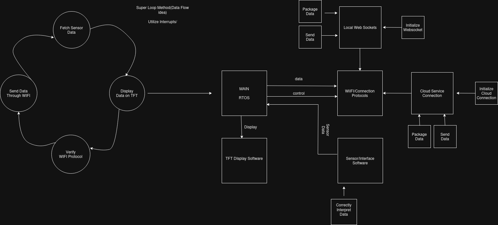

# Environmental Detection Systems Overview

In this project, the technical goal is to create an IoT device that interfaces primarily with the **BME280 Sensor** to measure a combination of **humidity**, **pressure**, and **temperature**.  
The data will be streamed over the web to a host computer that will process it accordingly.

I'm writing this document because I often get stuck as projects grow larger and more complex.  
This time, I want to improve my organization and planning skills to work more efficiently.

---

# Goals

With AI being a big part of any developer’s toolchain, I'm a personal believer that this is a good time for students to start focusing on the soft skills and planning necessary to create big projects. The reality is — I could've vibe coded a project like this in maybe a week given my previous background in a similar, but smaller project. However, my task in this project is less about having a "result" but moreso creating a sustainable architecture that can be flexible for any degree of sensor data.

## (Current) Goals
- Publicly Document progress too promote open source project material.
- Implement a sustainable embedded architecture that prioritizes planning, verification, and a solid foundation beyond functionality.
- Work towards proper explanation of each topic as well as adequete graphics for many of the plans that are to be made.
- Make sound engineering choices that take into the account each choices pros and cons (More on this later!)

---

# Component Overview

### The ESP32 and BME280

- **ESP32-S3:**  
  The ESP32 will serve as the main microcontroller for this project due to its versatility.  
  It will:
  - Collect sensor data  
  - Display it locally  
  - Send it over the web to the host computer

- **BME280:**  
  This sensor is highly versatile and well-documented.  
  It will collect humidity, pressure, and temperature data, which the ESP32 will read via **SPI**, process, and package for transmission.

### Other Peripherals

- **SPI TFT Display:**  
  A SPI TFT Display with LVGL Will be used to interface the sensor data.

---

### Circuit and Pin Level Overview of the ESP32, Sensor, Display(Now TFT):

---

# Technical Talk with Peripherals and Host through ESP32

###It can be easy with a solid plan to go straight into programming - however, it's important to know some aspects of the components to each hardware component we'll be using in order to suit our needs. 

---

## ESP32 and BME280 
  * I think this is an easier part that can be rushed - I mean, sensor interfacing and getting real world data is one the most exciting parts. However; previous attempts and easily interfacing with sensors can get messy for a number of reasons. I leading cause would obviously be imporper documenation, inexperience, etc, and therefore proper understanding of the BME280 and connection is necesasry for the project to succeed.
       * General BME280 Overview:
           * Physical/Electrical Characteristics:
               * 1.71V to 3.6V(So 3.3V is more then enough)
               * Extra Note: The PCB im using contaiend the decoupling capacitors necessary for us to do the protocols, otherwise I'd this here as well.
           *  Sensor Interafacing General:
               *  The Sensor Cotains 3 Modes: 2'b00 - Sleep Mode(Self Explanatory), 2'b01 - Forced Mode(Preform One Measurement, Store Result and Sleep), 2'b10 - Normal Mode (Perpetual Fetching of all Measurements, to be used mostly)
               *  Genearl Note: during normal mode, we can actually disable temperature readings for specific measurements if we desire.
               *  An important aspect of the BME280 is the IIR Filter - used mainly for pressure noise reduction because the external environment can quickly change it. There's a couple of modes we'll look into later
               *  Because of the number of settings, the BME280 datasheet actually has predetermined settings(That we should configure, of course)! In this scenario of weather modeling, we'll be using the following:
                 * Weather monitoring Setting:
                     * Mode Settings: Forced, 1 sample / minute,
                     * Over Sampling Settings: pressure ×1, temperature ×1, humidity ×1,
                     * IIR Filter Settings: filter off
                       
           * Reading Data from the BME280:
               * The datasheet recommends burst reading. meaning we sweep and read the range of register from 0x57 to 0x5E
               * The pressure and temperature are read out in 20 bits unsigned, while the humidity is an unsigned 16-bit format for humidity. < Note, these values aren't are final resault and they must be calculate using compensation paramaters
                 
           *There's a lot of other compleixities, that go into the BME280. In our scenario, the ESP32IDF contains an API that allows us to connect our BME280 to read data via I2C, which is good in regards to the fact the compensation formulas are very complex.

           *To the right contains the module for the bme280: https://components.espressif.com/components/espressif/bme280/versions/0.1.1/readme. In this cass we'll be in forced mode and can get any data at any point. 

## ESP and TFT Display with LVGL
  * Another important part of our program will be including the TFT Display and integrating it with ESP IDF. In this case we'll be using ILI9341 TFT Display with the ESP 32 IDF.
    
  * With LVGL, we'll be interfacing our ILI9341 similarly like this example - [https://github.com/espressif/esp-idf/blob/release/v4.4/examples/peripherals/lcd/lvgl/main/lvgl_demo_ui.c](https://github.com/espressif/esp-idf/tree/d7ca8b94c852052e3bc33292287ef4dd62c9eeb1/examples/peripherals/lcd/spi_lcd_touch)
    
  * Another Important part of this will be the actual "graphics," there's a host of cool applications to make light weight UI for LVGL. An important note; however, is storage - I've ran into storage issues with this previously and you might want to have more than 2MB if you have a very big UI. In this, I'll likely be using SquareLine Studio - https://squareline.io/ - which has a free option(haha)!

## ESP-32 and the Host Computer

   * This is a pretty big change for me in terms of embedded projects. Previously, I'd connect my ESP and host computer to a DB with AWS or Azure and stream data with it as a middle man. There's a couple of issues with those; however,
     * Cost: Having to set up any sort of cloud server costs money, and I lost all my Azure credits.
     * Speed: If we want to stream a lot of data, it's possible that we'll get rate limited. Chances are unlikely, but it's still a part of it.
     * Open Source/Working within your own means: I'm a big believer in open source technology. AWS and other services are pretty essential for modern internet life, but in this case there is many alternatives.

##So what are we going to do?

   *My initial plan is use to the ESP-32 as a webserver in order to server data that can be parsed by our host computer. This isn't a terrible idea actually, because it means we can switch between a "local" and a "cloud" mode. Local mode would allow for faster access when on the local network, while we'll likely use another cloud service for over the web. This means we'll have to utilize websockets and a cloiudserver for this task, as well as have a way to modify the networking mode via a push button.  

## Putting it together with Software - Setting up and Super Loops or RTOS
   * I think this is a pretty interesting part of the project that gets me tripped up. From previous experience, the utilization of RTOS scheduling seems resonable. I mean, it is a ESP32-S3 - a lot of the underlying utilizes(RTOS), so it makes sense that to some capacity we are using it in order to run our program. I'll like a "Super Loop" method that we'll act as a way to show the proccesses. In reality - will be using FreeRTOS tasks. The reason is even I "poll" or give lengthy wait times, there is no telling when, say, the cloud service takes a little longer, etc. I had a similar issue with a previous project and proepr implementation of RTOs will fix sending data over the web easier. 

### Software Overhead View:

### Software/Tasks Loops Diagrams:

# Creating the Host Interface:
---

* Another Important aspect of this project is making software on my computer that easily allows me to fetch and analyze the data. My only spite of previous projects is that I would tend to do this in one language, but it's common that a suite of software may utilize multiple(!) langauges to create an entire suite of software. Therefore I'll likely be utilzing both C++ and Python for this project. C++ will be utilzied for fetching and efficiently storing data quickly, while Python will read this data(say a file) plot and analyze it.

* C++/Data Collection:
  
  * An important part of the C++ Program in this case is being able not only to package data and write data properly but knowing when to recieve data from the cloud or locally. This is an important aspect that may take some consideration. However, a smart plan may be 
   
 
## Revision Section
   *  My original plan was to use a LCD Display with I2C and BME280 with I2C, I"m changing that to using a TFT Display with LVGL and SPI.
   *  Added a goals section

  

